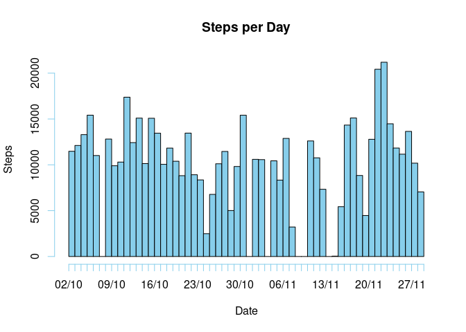
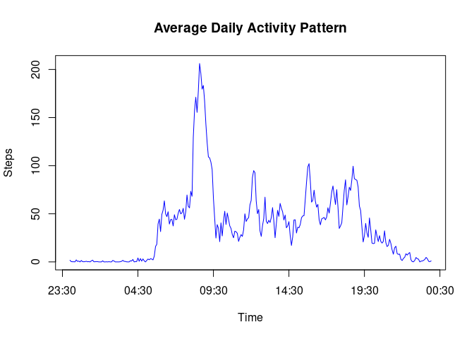
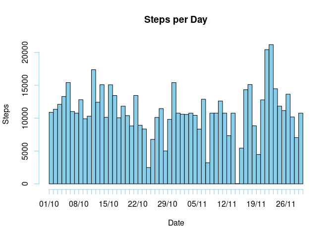
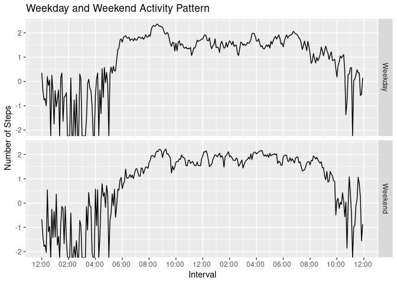

The following data analysis will be carried out on data obtained from an individual's
personal activity monitoring device. The data can be obtained [here](https://d396qusza40orc.cloudfront.net/repdata%2Fdata%2Factivity.zip).      

## **1. Loading and Reading the Data**

### Downloading the Data
The data can be downloaded to the desired directory using the following R commands:
 
 ```r
 if(!file.exists("./Data")){dir.create("./Data")}
 fileURL <- "https://d396qusza40orc.cloudfront.net/repdata%2Fdata%2Factivity.zip"
 download.file(fileURL, destfile = "./Data/activity.zip")
 ```
 
### Reading the Data
 The function `read.csv()` is then used to read the data file and store it in the variable *activityData*

```r
activityData <- read.csv("./Data/activity.csv", stringsAsFactors = FALSE)
```

Lets take a look at the data using `str()` function

```r
str(activityData)
```

```
## 'data.frame':	17568 obs. of  3 variables:
##  $ steps   : int  NA NA NA NA NA NA NA NA NA NA ...
##  $ date    : chr  "2012-10-01" "2012-10-01" "2012-10-01" "2012-10-01" ...
##  $ interval: int  0 5 10 15 20 25 30 35 40 45 ...
```

The class of the **date** variable is set as character. It would be more convenient to convert it to 
a date class using `as.POSIXct` function as follows:

```r
activityData$date <- as.POSIXct(activityData$date, "%Y-%m-%d")
```
    
## **2. Calculating the Mean Total Number of Steps Taken Per Day**

### Calculating the Total Steps Per Day
In order to calculate the total steps per day, the variable *steps* has to be grouped by the variable *date* using the `group_by()`. To find the sum, `summarise()` function is used as shown. These function are available in the dplyr package.

```r
library(dplyr)
totalSteps <- activityData %>% group_by(date) %>% summarise(Total.Steps = sum(steps, na.rm = TRUE))
head(totalSteps)
```

```
## # A tibble: 6 x 2
##   date                Total.Steps
##   <dttm>                    <int>
## 1 2012-10-01 00:00:00           0
## 2 2012-10-02 00:00:00         126
## 3 2012-10-03 00:00:00       11352
## 4 2012-10-04 00:00:00       12116
## 5 2012-10-05 00:00:00       13294
## 6 2012-10-06 00:00:00       15420
```

### Creating a Histogram of Total Steps Per Day
An histogram is a plot of the frequency of occurrence of certain values. In order to plot the number of steps taken per day, we will first create a vector of dates whereby the number of occurrence of each date corresponds to the number of steps taken. This is achieved by using `rep()` function.  
Once this is done, a histogram is made using `hist()` function as follows.

```r
datefreq <- with(totalSteps, rep(date, Total.Steps))
hist(datefreq, breaks = "day", freq = TRUE, col = "skyblue", xlab = "Date",ylab = "Steps", main = "Steps per Day", format = "%d/%m")
```

<!-- -->

### Calculating Mean and Median of the Total Steps per Day
The mean value can be calculated using `mean()` function.

```r
mean(totalSteps$Total.Steps, na.rm = TRUE)
```

```
## [1] 9354.23
```
The median value can be calculated using the `median()` function.

```r
median(totalSteps$Total.Steps, na.rm = TRUE)
```

```
## [1] 10395
```
    
## **3. Average Daily Activity  Pattern**
Here we group the data with respect to the measurement intervals, calculate the mean steps for each interval and then use the results to plot a line graph.

```r
intervalSteps <- activityData %>% group_by(interval) %>% summarise(Avg = mean(steps, na.rm = TRUE))
```
As the interval is not given in seconds but given in a format combining hours and minutes, we will have to add a new variable which reflects the change in interval more accurately.

```r
intervalSteps$hours <- intervalSteps$interval %/% 100
intervalSteps$mins <- intervalSteps$interval %% 100
intervalSteps$time <- with(intervalSteps, paste(hours, ":", mins, sep = ""))
intervalSteps$time <- as.POSIXct(intervalSteps$time, format = "%H:%M")
```
Finally, the plot!

```r
with(intervalSteps, plot(time, Avg, type = "l", col = "blue", xlab = "Time", ylab = "Steps", main = "Average Daily Activity Pattern"))
```

<!-- -->

By arranging the data set in descending order of average steps and taking the first value of the variable interval, we get the interval at which the maximum average step occurs.

```r
maxStep <- max(intervalSteps$Avg)
intervalSteps <- arrange(intervalSteps, desc(Avg))
maxInterval <- intervalSteps$interval[1]
print(maxInterval)
```

```
## [1] 835
```
The maximum average step of **206.1698113** occurs at an interval of **835**.    

## **4. Imputing Missing Values**  
### Calculating Number of NA Obseravtion
First, the total number of NAs are calculated.

```r
totalNA <- sum(is.na(activityData$steps))
print(totalNA)
```

```
## [1] 2304
```
We can see that there is a total of 2304 NAs present in our data set.

### Imputing NAs with Interval Mean
Missing values can be taken into account by replacing each occurrence of NA with the mean of the respective intervals. To do so, first we merge the original data frame and the data frame containing the averages of each interval.

```r
combined <- merge(activityData, intervalSteps, by = "interval", sort = FALSE)
```
  
Then we duplicate the the *steps* column under the variable *new* (this is done just as a precautionary measure to prevent any corruption of the original data) and replace all occurrences of NA with the *Avg* value.

```r
library(dplyr)
combined$new <- combined$steps
combined$new[is.na(combined$new)] <- combined$Avg[is.na(combined$new)]
newActivityData <- select(combined, -c(steps, Avg), "Steps" = new)
```

### Creating a Histogram with New Data
The steps shown in (1) can be repeated with the new data set to obtain a new histogram (shown below).

```r
newTotalSteps <- newActivityData %>% group_by(date) %>% summarise(Total.Steps = sum(Steps))
newDatefreq <- with(newTotalSteps, rep(date, Total.Steps))
hist(newDatefreq, breaks = "day", freq = TRUE, col = "skyblue",xlab = "Date",ylab = "Steps",
     main = "Steps per Day",format = "%d/%m")
```

<!-- -->

The new mean and median values are as follows:

```r
mean(newTotalSteps$Total.Steps)
```

```
## [1] 10766.19
```

```r
median(newTotalSteps$Total.Steps)
```

```
## [1] 10766.19
```
The mean and median values have increased.
  
## **5.Comparing Activity Pattern Between Weekdays and Weekends**
In this section, we will be comparing the activity patterns obtained from weekdays and weekends. To do so we create a new variable *days* using the `weekdays()` function and assign a separate factor for weekdays and weekends.

```r
newActivityData$date <- as.Date(newActivityData$date, format = "%Y-%m-%d")
newActivityData$days <- weekdays(newActivityData$date)
weekends <- grepl("Saturday|Sunday", newActivityData$days)
newActivityData$factor <- rep("Weekday", nrow(newActivityData))
newActivityData$factor[weekends] <- "Weekend"
newActivityData$factor <- as.factor(newActivityData$factor)
```
Before plotting we have to convert the interval values to a continuous form. The steps are similar to that in (3)

```r
newActivityData <- group_by(newActivityData, factor, interval)
averageSteps <- summarise(newActivityData, average = mean(Steps))
averageSteps$hours <- averageSteps$interval %/% 100
averageSteps$mins <- averageSteps$interval %% 100
averageSteps$time <- with(averageSteps, paste(hours, ":", mins, sep = ""))
averageSteps$time <- as.POSIXct(averageSteps$time, format = "%H:%M")
```
Now we plot!

```r
library(ggplot2)
a <- ggplot(averageSteps, aes(time, log10(average))) + geom_line() +
  facet_grid(factor~.) +
  labs(x = "Interval", y = "Number of Steps") +
  ggtitle("Weekday and Weekend Activity Pattern") +
  scale_x_datetime(date_breaks = "2 hour", date_labels = "%I:%M ")

print(a)
```

<!-- -->

  
